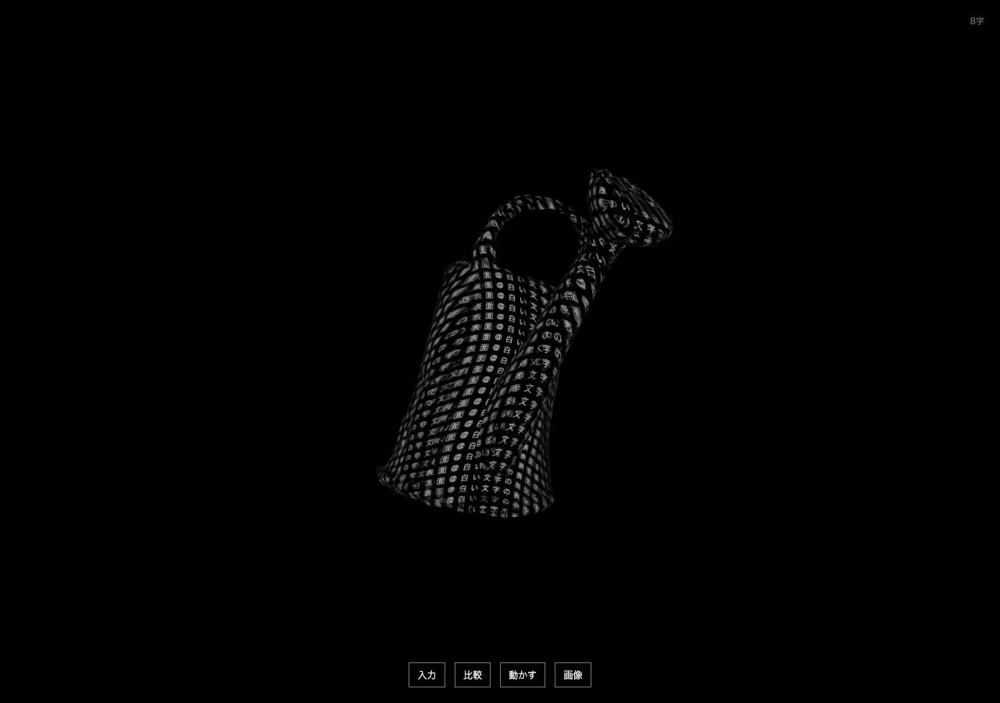

# Semantic Glyph Lab

文章から関連する立体を選ぶ・作ることで、蓄積した言葉をその表面に流す研究試作。[文字のかたち](https://github.com/KOSEIHAMAYA2077/ai-game-lab)から独立した別版です。

**次の研究方針（2026-09-30）:** [先行研究6件と制作例1件](research/prior-art-20260930.md)を整理し、[表面の長時間安定性 → 条件付きのCube比較 → 部分編集](research/roadmap-20260930.md)の順に進めます。[比較・採用基準](research/evaluation-plan-20260930.md)も記録しました。この追加は調査と設計で、新しいモデルの実行や試作の変更はまだ行っていません。

**応用時の目標:** [研究成果を一般的なPCで動かす方針](research/consumer-pc-20260930.md)。現在の研究条件は維持し、応用段階で事前計算・近似・軽量化を検討します。

**[今回の結果と採用した構成](research/RESULTS-20260930.md)**。保存版は `prototype-v0.5.0`。任意の文章を常に正しい形へ変換する完成品ではなく、複数の方法を実際に比較できる試作です。

## 試す

Node.jsを用意し、`npm ci --ignore-scripts`、`npm run dev`。ブラウザで http://127.0.0.1:4183 を開く。意味モデルの準備・起動は[server/README.md](server/README.md)。未起動でも明示した物体名による基準表示は使えます。

このMacの取得済み環境を再開する場合は `python3 tools/run-lab.py`。使用中のポートは確認して再利用し、既存のサービスは終了させません。環境の自動インストールは行いません。状態だけなら `python3 tools/run-lab.py --check`。[このMacの再開と新規導入の範囲](research/setup-scope.md)を分けて記録しています。

Enterで入力を開き、文章を入れてEnter。ドラッグで回転、スクロールで距離。比較から生成した形・無料素材・密度・流れ・形の揺らぎを選べます。

**続けて文章を入力する別入口:** http://127.0.0.1:4183/src/writing-preview/index.html 。通常画面の「比較」からも開けます。最初は「文字だけ加える」。新しい物体を作るときは「文章から形を作る」、`四角く`などの追記は「今の形を変える」を選びます。生成中も次の文章を送れます。[動作・待機・原文の保存範囲](experiments/writing-preview/README.md)。両入口を `npm run build` の対象にしています。

- `花瓶` → `四角くねじれた`：花瓶を維持し、属性を変える。
- `腰を下ろして休めるもの`：ローカル意味モデルが椅子を選ぶ。
- `白い剣` → `赤い球体`：先に入れた文字の色を残す。

意味検索は24種からの選択です。比較の「部品から作る」はローカル言語モデルで形状を組み合わせ、「英語から立体生成」はShap-Eで新しいメッシュを生成します。画像から復元した形や、生成済みの比較例も選べます。操作中の文章は端末内で処理し、文章の自動保存・外部送信をしません。再読み込みすると入力履歴は消えます。画像は「画像」ボタンで明示的に保存できます。

## 実験の選び方

| 方式 | 入力例 | 特徴と制限 |
|---|---|---|
| 意味から選ぶ | 腰を下ろして休めるもの | 24形状の検索。言い換えに反応。 |
| 素材の候補を見る | 長い注ぎ口が付いたじょうろ | 取得済み3CC0素材を順位付け。候補を自分で選び、選択後に属性を変える。 |
| 部品から作る | 花瓶から木が生えている | 数秒。位置や部位数を間違えることがある。 |
| 文章から立体生成 | 取っ手が左右についた花瓶 | ローカル8Bモデルで英語の説明を作ってShap-Eへ。約1分。誤訳もある。 |
| 文章→画像→立体 | 白い陶器の花瓶 | ローカルで画像を生成して立体へ復元。初回実測約30秒。裏面や細部の誤りあり。 |
| 英語から直接生成 | a ceramic vase with two handles | 約40秒。未知の形を生成するが細部は崩れる。 |
| 生成・復元した形 | 比較欄から選択 | このMacで生成・復元済みのGLBを比較。 |

部品APIは[起動・評価記録](experiments/composition/README.md)、直接生成APIは[実験記録](experiments/generation/)、画像経由APIは[起動と制限](experiments/text-image-live/README.md)。日本語からの説明専用APIは[4B/8Bの比較と起動](experiments/translation-model/README.md)。モデル取得は別途必要です。新しいMacへの一括導入はまだ検証していません。

「文字の動かし方」で面を覆う投影と、文字ごとに面をたどる移流を比較できます。取り込んだGLBにも、意味方式で「四角く、ねじれた」と追記すると元の形を保って変形します。「形の揺らぎ」は、文字の流れとは別に母体をゆっくり歪めます。初期値は0です。「渦で流す・実験」は平面の流体を面へ投影し、数分で文字が伸びる制限があります。「流れを戻す」で文章と形を保って流れだけ初期化できます。

## 記録

以下の視覚・語義の判定は、担当エージェントによる画面確認と原出力の読解です。ユーザーテストや人間の参加者による評価は行っていません。

- [目的と制約](BRIEF.md) / [進捗](STATUS.md)
- [共通の文字表面表示 v0.1](experiments/surface-01/RESULTS.md) / [v0.2と修正](experiments/surface-02/RESULTS.md) / [v0.3の統合](experiments/surface-03/RESULTS.md) / [v0.4の素材候補と渦](experiments/surface-04/RESULTS.md)
- [今回の実装方針と次の学習実験](research/implementation-options.md)
- [同じ日本語から2方式で作った6形状](experiments/end-to-end/RESULTS.md)
- [自動振り分けの初回失敗](experiments/input-routing/README.md) / [二段階での比較](experiments/input-routing-v2/README.md) / [14Bの比較](experiments/input-routing-model/RESULTS.md)
- [4B Instructの振り分け比較](experiments/input-routing-instruct/README.md)
- [素材検索・521件の比較と3メッシュ](experiments/asset-retrieval/RESULTS.md) / [対話画面の3候補](experiments/asset-retrieval/ui-v1/README.md)
- [流体の表面投影と長時間の制限](experiments/fluid-surface/README.md)
- [連続入力のCPUハーネス](experiments/continuous-input/RESULTS.md) / [操作を選べる独立画面 v0.5](experiments/writing-preview/README.md)
- [関連研究9件と実装方針](research/language-to-shape.md)
- [LLM部品合成の7条件比較](experiments/composition/README.md)
- [TripoSR画像からの復元](experiments/triposr/RESULTS.md)
- [文字の面上移流](experiments/advection/RESULTS.md)
- [文章→画像→立体の比較と失敗](experiments/text-image/RESULTS.md) — **Powered by Stability AI**
- [軽量翻訳・4B/8B説明モデル比較](experiments/translation-model/README.md)
- [追加3D候補の公開採用を見送った理由](experiments/advanced-mesh/README.md)
- [日本語の説明変換](experiments/translation/README.md)
- [操作・通信・オフライン規則のレビュー](experiments/review-20260930/RESULTS.md)
- [意味検索・ルールの評価](experiments/semantics/REPORT.md)
- [Shap-E生成・失敗・抽出解像度の比較](experiments/shap-e/RESULTS.md)
- [既存3D素材の出所](research/mesh-assets.md)

検証: `npm test`、`npm run build`。ブラウザ検証は意味API起動後 `npm run test:e2e`。このMacではChromeを利用。詳しい設定はplaywright.config.ts。

モデル重み・個人原稿は公開Gitへ含めません。モデルや素材の出所・ライセンス・取得ハッシュは各実験のmanifestへ記録しています。研究試作であり、任意の文章が常に期待どおりに立体化するとは主張していません。
