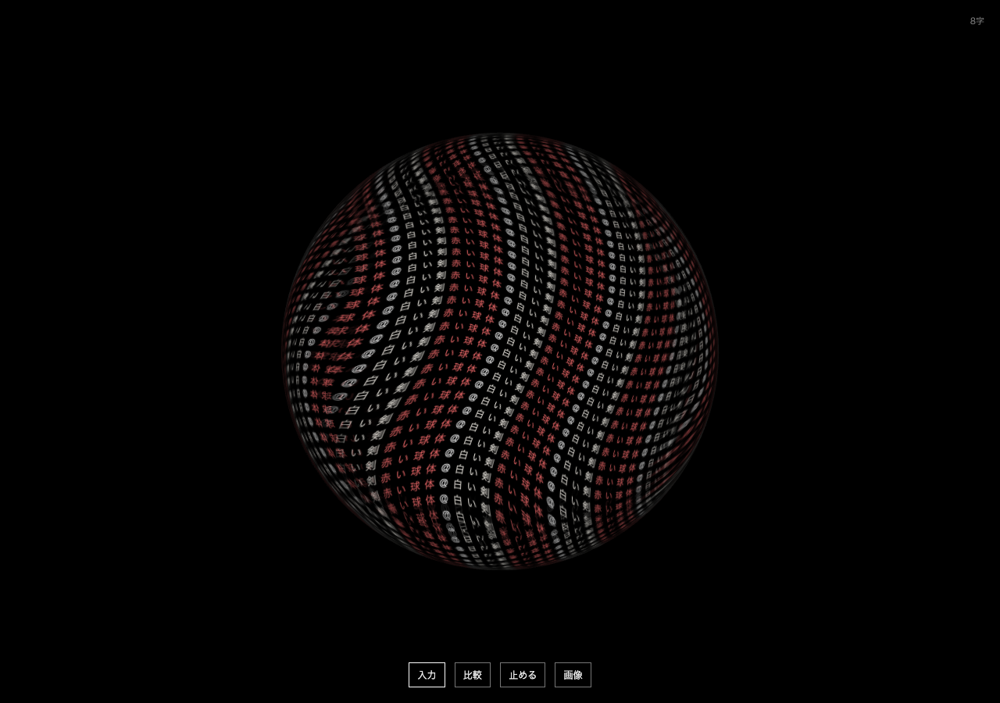

# Semantic Glyph Lab

文章から関連する立体を選ぶ・作ることで、蓄積した言葉をその表面に流す研究試作。[文字のかたち](https://github.com/KOSEIHAMAYA2077/ai-game-lab)から独立した別版です。

## 試す

Node.jsを用意し、`npm ci --ignore-scripts`、`npm run dev`。ブラウザで http://127.0.0.1:4183 を開く。意味モデルの準備・起動は[server/README.md](server/README.md)。未起動でも明示した物体名による基準表示は使えます。

このMacの取得済み環境を再開する場合は `python3 tools/run-lab.py`。使用中のポートは確認して再利用し、既存のサービスは終了させません。環境の自動インストールは行いません。状態だけなら `python3 tools/run-lab.py --check`。

Enterで入力を開き、文章を入れてEnter。ドラッグで回転、スクロールで距離。比較から生成した形・無料素材・密度・流れを選べます。

- `花瓶` → `四角くねじれた`：花瓶を維持し、属性を変える。
- `腰を下ろして休めるもの`：ローカル意味モデルが椅子を選ぶ。
- `白い剣` → `赤い球体`：先に入れた文字の色を残す。

意味検索は24種からの選択です。比較の「部品から作る」はローカル言語モデルで形状を組み合わせ、「英語から立体生成」はShap-Eで新しいメッシュを生成します。画像から復元した形や、生成済みの比較例も選べます。操作中の文章は端末内で処理し、保存・外部送信しません。再読み込みで入力は戻ります。

## 実験の選び方

| 方式 | 入力例 | 特徴と制限 |
|---|---|---|
| 意味から選ぶ | 腰を下ろして休めるもの | 24形状の検索。言い換えに反応。 |
| 部品から作る | 花瓶から木が生えている | 数秒。位置や部位数を間違えることがある。 |
| 文章から立体生成 | 取っ手が左右についた花瓶 | ローカルで英語の説明を作ってShap-Eへ。約1分。誤訳もある。 |
| 英語から直接生成 | a ceramic vase with two handles | 約40秒。未知の形を生成するが細部は崩れる。 |
| 生成・復元した形 | 比較欄から選択 | このMacで生成・復元済みのGLBを比較。 |

部品APIは[起動・評価記録](experiments/composition/README.md)、直接生成APIは[実験記録](experiments/generation/)。モデル取得は別途必要です。

「文字の動かし方」で面を覆う投影と、文字ごとに面をたどる移流を比較できます。取り込んだGLBにも、意味方式で「四角く、ねじれた」と追記すると元の形を保って変形します。

## 記録

- [目的と制約](BRIEF.md) / [進捗](STATUS.md)
- [共通の文字表面表示 v0.1](experiments/surface-01/RESULTS.md) / [v0.2と修正](experiments/surface-02/RESULTS.md)
- [関連研究9件と実装方針](research/language-to-shape.md)
- [LLM部品合成の7条件比較](experiments/composition/README.md)
- [TripoSR画像からの復元](experiments/triposr/RESULTS.md)
- [文字の面上移流](experiments/advection/RESULTS.md)
- [文章→画像→立体の比較と失敗](experiments/text-image/RESULTS.md) — **Powered by Stability AI**
- [日本語の説明変換](experiments/translation/README.md)
- [操作・通信・オフライン規則のレビュー](experiments/review-20260930/RESULTS.md)
- [意味検索・ルールの評価](experiments/semantics/REPORT.md)
- [Shap-E生成・失敗・抽出解像度の比較](experiments/shap-e/RESULTS.md)
- [既存3D素材の出所](research/mesh-assets.md)

検証: `npm test`、`npm run build`。ブラウザ検証は意味API起動後 `npm run test:e2e`。このMacではChromeを利用。詳しい設定はplaywright.config.ts。

モデル重み・個人原稿は公開Gitへ含めません。モデルや素材の出所・ライセンス・取得ハッシュは各実験のmanifestへ記録しています。研究試作であり、任意の文章が常に期待どおりに立体化するとは主張していません。
