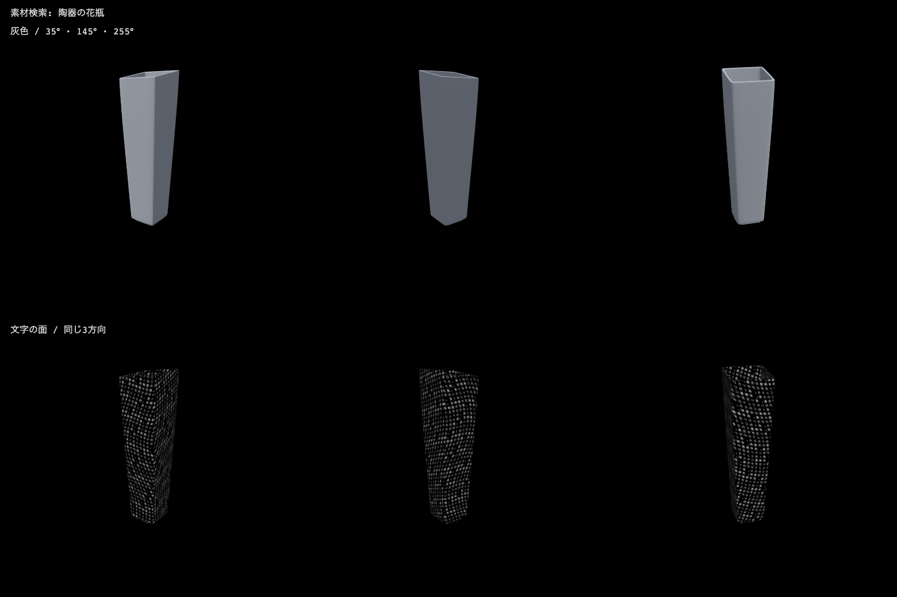
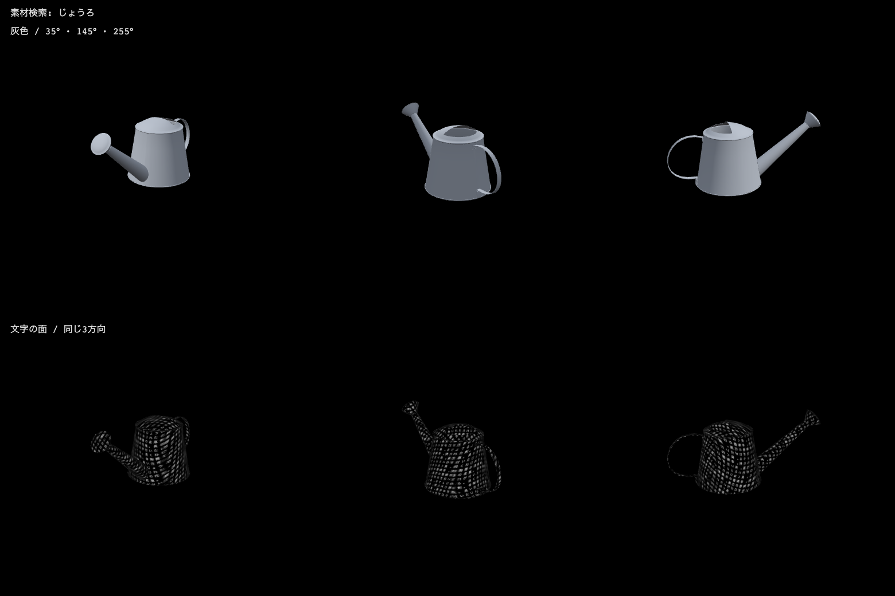
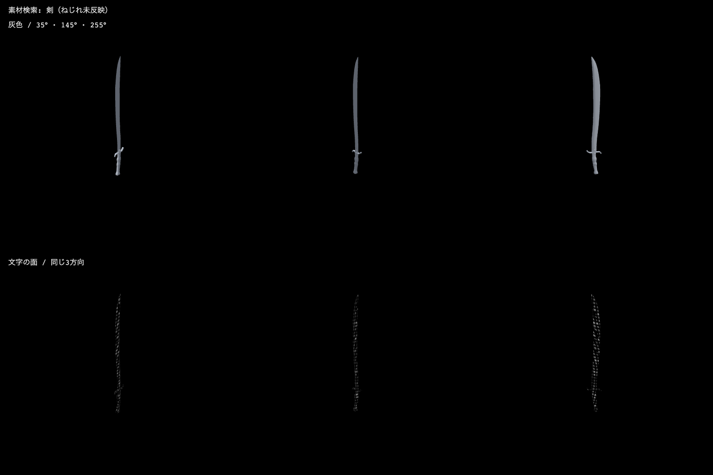

# 素材検索の結果と、文字の面への接続

2026-09-30。10人工例はカタログ取得と推論の前に固定した。521件の英語メタデータを多言語MiniLMで比較し、形そのものやプレビュー画像は検索入力にしていない。

| 日本語の要点 | 素材名だけの1位 | 名前＋説明の1位 | 評価 |
| --- | --- | --- | --- |
| 陶器の花瓶 | Ceramic Vase 03 | Ceramic Vase 03 | 対象・材質とも一致。 |
| 長い注ぎ口のじょうろ | Pipe Wrench | Watering Can Metal 01 | 説明を足すと、対象と長い注ぎ口を拾えた。 |
| 長くねじれた剣 | Ornate Medieval Dagger | Wooden Handle Saber | 説明ありは剣の種類としては候補になるが、ねじれはない。部分一致。 |
| 木製の椅子 | Wooden Chair 01 | Painted Wooden Chair 01 | 対象・材質とも一致。 |
| 木の樽 | Wooden Barrels 01 | Wooden Barrels 01 | 木の樽のセット。単体だけが必要な場合はセットの扱いが別途必要。 |
| 革のサッカーボール | Football | Dirty Football | 名前だけの1位はAPI材質がrubber/plastic。説明ありはleatherも含み、要求に近い。 |
| 馬の彫刻 | Horse Statue 01 | Horse Statue 01 | 馬の彫刻を選べた。 |
| 開いた傘 | Covered Car | Wet Floor Sign 01 | どちらも別物。この一覧で傘を確認できない。 |
| 三つの輪の鎖 | Spinning Wheel 01 | Modular Airduct Circular 01 | どちらも別物。三つの輪の連結を満たさない。 |
| 静かな気分 | Dry Quiver Leaf | Mid Century Lounge Chair | 具体物の指定ではない。近傍を勝手に正答としない。 |

対象の種類が上位に来たことと、全条件を満たすことを分ける。説明ありでは花瓶・じょうろ・椅子・樽・サッカーボール・馬の6件が対象に対応し、剣は部分一致。樽はセットなので、単数のメッシュを自動的に保証するものでもない。傘や三つの輪は今回の一覧の名前・説明・タグを追加確認しても対象を確認できなかった。Poly Haven全体の将来の配布物に絶対に存在しないという主張ではない。

語義評価は担当エージェントが固定条件と出力を読んで行った。ユーザーや外部の人間による独立評価ではない。閾値は調整せず、検索結果を修正する日本語の別名辞書も加えていない。全top5と時間は [retrieval-results.json](retrieval-results.json)。

## 3点の実メッシュ

灰色と文字面を同じカメラの3方向で比較した。長辺2.6へ表示上正規化、仰角20°、方位35°/145°/255°、距離7.2、密度15、時刻12秒。元メッシュはY-upのglTF座標を保ち、形の揺れは0に固定した。画像はサイトのプレビューではなく、この実験での独自描画。Powered by [Poly Haven](https://polyhaven.com/)。

花瓶は四角い断面の細長い胴。口が開いており、内外の面がある。文字面も輪郭だけでなく広い面を覆う。元の陶器の色と凹凸テクスチャは派生GLBに含めない。

じょうろは胴と長い注ぎ口、持ち手、上の開口が読み取れる。端部の細かい穴はgeometry-only表示では見えず、公式説明のすべての表面細部を三角形だけで再現するわけではない。持ち手は細いので、文字の幅が小さくなり暗く見える方向もある。生成モデルで観察した胴や注ぎ口の曖昧さに対し、この取得素材では全体と部品の配置を保てた。

サーベルの刃・柄・鍔は形として読める。ただし刃は非常に薄く細長いため、遠目では文字の面が狭い線のように見える。素材は湾曲した剣であり、検索語の「ねじれた」を満たしていない。取得後の属性変形を行ったとは説明しない。

| モデル | 頂点 | 三角形 | 派生GLB bytes | X/Y/Z寸法（元glTF単位） |
| --- | ---: | ---: | ---: | --- |
| Ceramic Vase 03 | 7,263 | 11,136 | 308,992 | 0.1122 / 0.4144 / 0.1122 |
| Watering Can Metal 01 | 7,741 | 11,837 | 328,844 | 0.1910 / 0.1968 / 0.4523 |
| Wooden Handle Saber | 2,675 | 4,031 | 113,580 | 0.0257 / 0.9355 / 0.1228 |

派生GLBはマテリアル・画像を落とし、頂点・三角形・法線を保持した。保存後に読込み、位置と面の一致を確認。元glTFを中心に移動させる加工はしておらず、表示側がbounding boxを中央へ移している。位相の検査用コピーだけ頂点を結合すると、花瓶1部品・じょうろ5部品・剣7部品。結合前後の数を混ぜず、別部品や非watertightを自動的な失敗とは数えない。元の部品構造や隙間を勝手に修復しない。

## 実時間と使える範囲

CPU2スレッド・既存MiniLM ONNXのモデル読込は [実測JSON](retrieval-results.json) に記録した。521件のindex作成は名前だけ約0.423秒、名前＋説明約2.212秒。各日本語文の検索は数ミリ秒。モデルもGPUを使わず、推論時のIP接続試行は0。ブラウザはSwiftShaderを確認し、3モデルの灰色＋文字3方向を描画した。page error、外部request、WebGL errorは0。[描画検証](views-v1/screens/verification.json)。

画面用に取得済み3点だけを対象とする場合、候補集合が変わるため521件の成績を流用できない。新しく書いた短い英語説明を使い、同じ10例を**取得後の再利用診断**として別に試した。その結果は [downloaded-results.json](downloaded-results.json) で、未見試験ではない。

この3件診断では、未所蔵の「馬の彫刻」が花瓶0.487686となり、正しい「長い注ぎ口のじょうろ」の0.442570を上回った。1位と2位の差もそれぞれ約0.233と0.133。スコアや差だけで閾値を作ると、未知対象を誤って採用したり正しいじょうろを落としたりする。候補表示・選択なら役立つが、自由文からの無条件の自動置換には別の対象確認が必要。

## 出所と再配布

[公式API仕様](https://github.com/Poly-Haven/Public-API/blob/master/swagger.yml) と [利用条件](https://github.com/Poly-Haven/Public-API/blob/master/ToS.md) を確認し、固有User-Agentで一覧1回と3素材のファイル一覧を取得した。3D素材は [CC0](https://polyhaven.com/license)。原本15ファイルは5,196,368 bytes、一覧とファイル一覧を含めても5,833,081 bytesで、1GB枠内。公開する3派生GLBは751,416 bytes。

一覧の生JSONや公式説明全文、サイトのレンダー画像は公開しない。公開manifestには素材ID・名称・作者・出所・ライセンスと、実験で新しく書いた短い説明だけを含める。各原本のSHA256と公式MD5は [取得記録](source-manifest.json)。素材は [花瓶](https://polyhaven.com/a/ceramic_vase_03)、[じょうろ](https://polyhaven.com/a/watering_can_metal_01)、[剣](https://polyhaven.com/a/wooden_handle_saber)。
