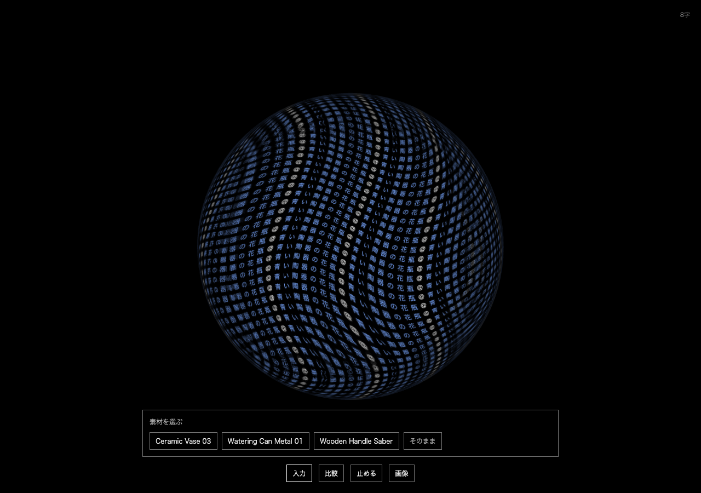
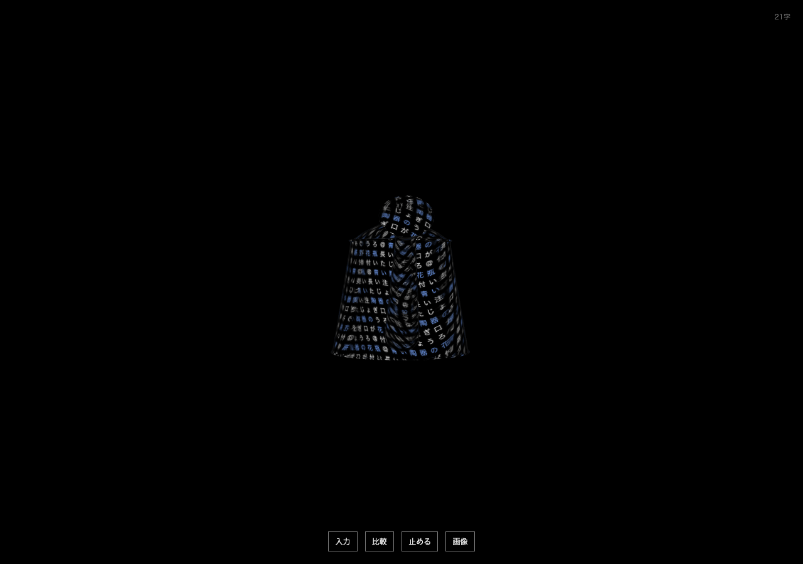

# 素材候補の通常UI接続

2026-09-30。研究用521件の検索と、対話画面の3件だけの検索は別の候補集合。

比較から「素材の候補を見る・実験」を選び、文章を送信する。原文を文字面へ一度だけ追加し、現在の形を保ったまま3候補を近い順に表示する。いずれかを選ぶとそのGLBを表示し、「そのまま」なら形を保つ。スコアによる自動置換はしない。

形を選んだ後の「四角く」「赤くねじれた」など完全な属性命令は、取得メッシュを維持して変形する。検索文に含む任意の形容・部位の条件を自動的に適用したとは扱わない。禁止文や新名詞を含む文は属性だけの編集へ回さない。部位だけを変形する機能はない。

## このMacで確認したこと

- 実APIでじょうろが首位になる一方、未所蔵の馬では花瓶が首位になった。全候補は有限のscoreで降順、selected/thresholdフィールドなし。結果は real-api-results.json。
- 素材APIのHTTP/Unicode/カタログ/realpath/非有限値等の境界12群が通過。埋込は既存の端末内CPUモデル。
- Playwright 6件: 原文の一重追加、形保持、候補選択時の非重複、高得点でも未所蔵対象を自動採用しない、次の入力/方式変更/手動loadで古い候補を破棄、属性編集、遅いGLBの競合保護。検索の順位はモック、3GLBは実ファイル。tests/retrieval.spec.ts。
- 実IABでも日本語のじょうろ文を検索し、3候補の先頭から取得GLBを選択。14文字のまま選択後に増えないことと、胴・取っ手・注ぎ口に文字が載る表示を確認した。
- 色形容「赤く」の残余で編集でなく検索になる問題を実操作で見つけ、属性判定のみに正規化を追加。色付き属性と禁止文は追加単体・ブラウザ回帰で確認。




## 起動と範囲

public/retrieval-models の3GLBとmanifestは公開cloneに含まれる。研究用521件の非公開生メタデータは通常UIに不要。server/README.mdの意味モデル環境を準備した後、同じ環境で起動する。

```sh
.local/semantics-venv/bin/python server/retrieval.py
```

4189のloopback API、4183のVite proxyから利用。入力本文はログ・ファイルへ保存せず、外部へ送信しない。4,000文字まで受付するが、意味検索に使うのは**末尾128トークンのみ**。文章全体を理解する機能ではない。上記2例は取得後の診断であり未見精度評価ではない。

取得素材はCC0。Powered by [Poly Haven](https://polyhaven.com/)。出所と原本hashは親フォルダのsource-manifest.json、取得条件はTERMS.md。
