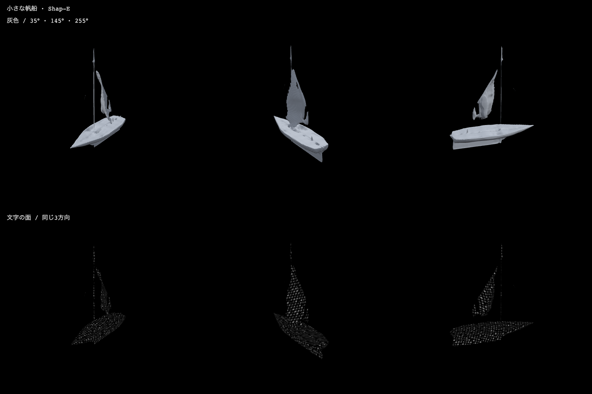
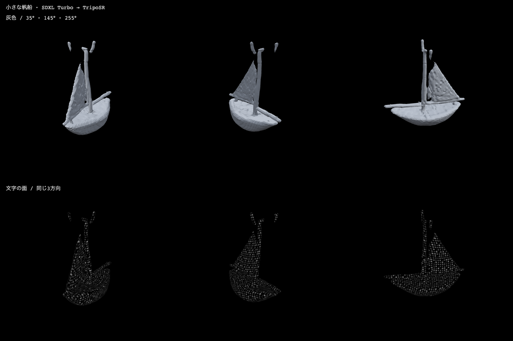
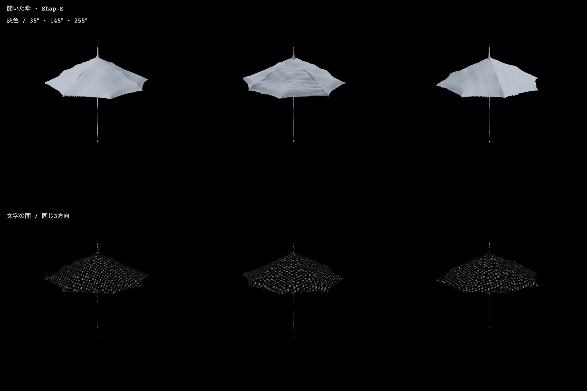
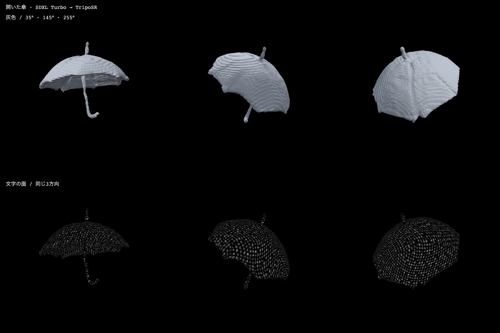
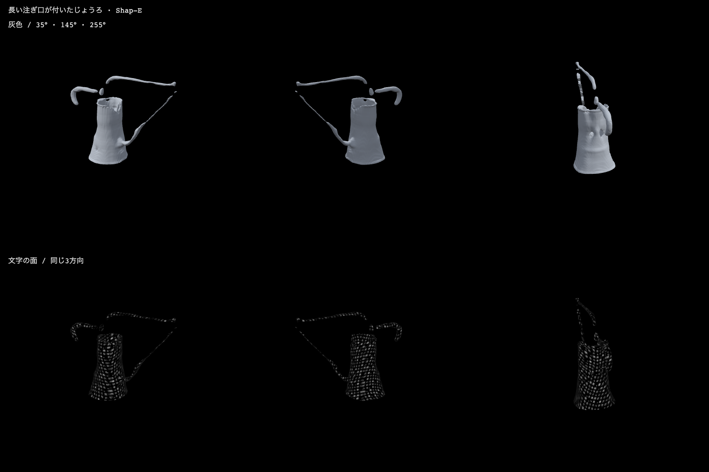
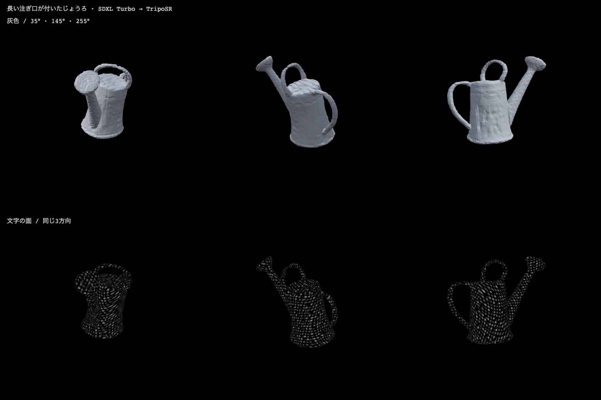

# 同じ日本語から作った6つの形

**Powered by Stability AI**

2026-09-30、Apple M5 / 32GB。3件とも物体と主な条件を保った英語になり、両生成方式へ同じ英語をそのまま送った。6件全てがHTTP200でGLBを返したが、部品の切れや裏側の変形は残った。今回のじょうろでは画像経由の方が部品を保ち、傘の面ではShap-Eの方が薄く自然に見えた。方式全体の勝敗を決める実験ではない。

[入力と採点基準を固定したprotocol](protocol.json) は推論前の06:19:10 UTCにハッシュを記録した。生成開始は06:20:33 UTC。翻訳はQwen3-8B-MLX-4bit、revision `383413e909f3bc5303ce195ebbdf0339c5a1a2a3`、temperature 0、thinkingなし。実際の英語は次の通り。

| 人工入力 | 無修正で共通に渡した英語 | 説明化のHTTP時間 |
|---|---|---:|
| 小さな帆船 | a small sailboat | 1.564秒 |
| 開いた傘 | an open umbrella | 1.585秒 |
| 長い注ぎ口が付いたじょうろ | a long spout watering can | 3.569秒 |

じょうろの英語はやや不自然だが、名詞と長い注ぎ口という条件は保っている。手直しも再試行もしていない。各APIのhealthにはモデルとrevisionを残した。[全HTTP結果](paired-v1/results.json)

## 同じ3方向から見た形

各画像の上段は灰色、下段は同じ人工文の文字を載せた面。最大辺2.6、方位35° / 145° / 255°、仰角20°、距離7.2を共通にした。修復・平滑化・小片の除去はしていない。固定の上方視点では完全な下面の評価はできない。

| 例 | Shap-E | SDXL Turbo → TripoSR |
|---|---|---|
| 帆船 | 船体・帆は分かるが、帆やマストが分離。マストが細い | 丸い船体と帆が分かる。マストは太いが先端に浮いた小片 |
| 開いた傘 | 薄い傘面は読みやすい。軸と柄が細線・点に近い | J字の柄が残る。傘面が厚く、裏側が塊に近い |
| 長い注ぎ口のじょうろ | 胴はあるが、注ぎ口と取っ手に切れ・浮遊片が多い | 胴・長い注ぎ口・取っ手が明瞭。注ぎ口先端の孔は塞がる |

帆船 / Shap-E:

帆船 / 画像経由:

傘 / Shap-E:

傘 / 画像経由:

じょうろ / Shap-E:

じょうろ / 画像経由:

広い面はどちらも文字で覆える。細いマスト・柄・注ぎ口では文字の模様が点や筋に見え、読み取りにくい。形が分離している部分に文字を載せても、接続は直らない。逆に、生成された厚い塊や余分な小片もそのまま文字で強調される。したがって文字の描画だけでなく、母体の部品・厚さの品質が必要になる。[基準別の目視判定](paired-v1/assessment.json)

## 時間とメッシュ

| 例 / 方式 | 生成APIのHTTP待ち | 説明化＋生成 | 面数 | 成分数 | 最大成分の面積割合 |
|---|---:|---:|---:|---:|---:|
| 帆船 / Shap-E | 47.677秒 | 49.241秒 | 30,570 | 9 | 71.55% |
| 帆船 / 画像経由 | 17.677秒 | 19.241秒 | 17,120 | 5 | 97.99% |
| 傘 / Shap-E | 41.052秒 | 42.636秒 | 70,324 | 4 | 99.16% |
| 傘 / 画像経由 | 17.799秒 | 19.384秒 | 21,252 | 1 | 100% |
| じょうろ / Shap-E | 40.968秒 | 44.536秒 | 38,676 | 22 | 86.05% |
| じょうろ / 画像経由 | 15.804秒 | 19.373秒 | 17,416 | 1 | 100% |

Shap-Eは既にモデルを読んだ常駐worker、画像経由は毎回2つのworkerを起動する条件。両者ともseed番号は20260930で、Shap-Eは32 step、SDXL Turboは4 step、抽出格子は128³。ただしseedの番号が同じでも異なるモデルの乱数過程を揃えたことにはならない。画像経由はAPI内部で固定の背景・画角の文を足すため、生成モデルが読む最終全文までは同一ではない。

計測中、別の機械学習推論は実施せず、通常のアプリ描画は並行していた。これらは実使用条件での観測待ち時間であり、GPUを専有した統計的な性能比較ではない。各方式1回のみで、初回ロード・キャッシュ状態も完全には揃えていない。説明化＋生成は同じ説明化時間を各方式へ加えた値で、画面操作やGLBのブラウザ表示時間を含まない。

## 検証と制限

GLBは生のAPI応答を保存し、ハッシュ・有限座標・再読込・面数・成分を確認した。共通描画で6個全てを読み、WebGL error 0、ページ例外0、外部ドメインへの要求0。[描画の検証](paired-v1/screens/verification.json) に撮影時のソースhashを残した。生成中に確認対象のsrc/serverファイル変更はなかった。

成分数が多いほど必ず悪いわけではない。複数部品の物体もあり得るため、今回は画像で浮遊片と切れを確認して判断した。閉曲面や1成分も意味的な正しさを保証せず、傘の厚い裏側のような誤りは残る。

この実験では中間画像とマスクをライブAPIが保存しないため、各欠損が画像生成・前景除去・立体復元のどこで生じたかまでは切り分けられない。文字の面被覆も目視であり、被覆面積率や可読性の数値評価ではない。3例・1seedから一般的な成功率や任意文章への対応能力は主張しない。

公開用6件は [manifest](../../public/end-to-end-models/manifest.json)。出所は本実験の人工生成のみ。モデルの利用条件とライセンスリンクも各項目へ記録した。
