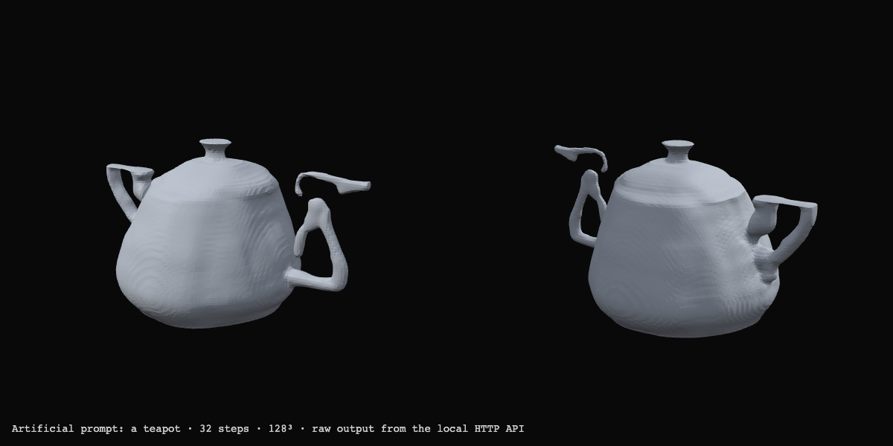

# Local English text → generated mesh

This experiment turns a short English object description into a new GLB mesh using the pinned Shap-E model. It reuses the earlier research environment and verified weights; no additional model download or global environment change was needed. It does not restrict the input to the 24 procedural shapes. This also means geometry can be malformed or only loosely related to the description.

## Run and API

From the repository root, with the existing [Shap-E environment](../shap-e/README.md):

```sh
.local/shap-e-venv/bin/python server/generation.py
```

The service binds only `127.0.0.1:4186`. It loads the model before announcing readiness. The app at port 4183 forwards `/generate-api/health` and `/generate-api/generate` to this service.

| Request | Response |
| --- | --- |
| `GET /health` | JSON with readiness, busy state, model revision, device and limits |
| `POST /generate` with `Content-Type: application/json` and `{"text":"a teapot"}` | Binary `model/gltf-binary` |

Success headers include `X-Generation-Ms`, `X-Sample-Ms`, `X-Generation-Seed`, `X-CLIP-Tokens`, and `X-Mesh-Faces`. Generation time covers sampling, surface extraction, GLB encoding and in-memory reload; initial model loading and network transfer are outside that header's measurement.

Input is limited to 1–300 printable ASCII characters, with English letters required. CLIP's actual tokenizer must fit the complete description within 77 tokens, including start and end markers. Longer descriptions are rejected instead of silently truncated. Japanese-to-English translation is outside this API's scope.

Only one generation runs at a time. A simultaneous request gets 503 immediately rather than entering an unbounded queue. Invalid text gets 400, unexpected content type 415, oversized request bodies 413, forbidden Host/Origin 403, model errors 500, and a generation timeout 504. The default generation timeout is 120 seconds; `--timeout` accepts 30–180 seconds. A timeout stops only this service's owned inference subprocess. A subsequent request starts a fresh worker. Model startup has a separate 90-second limit.

## Boundaries and provenance

- Requests and output meshes stay in process memory and the local HTTP response. The API writes neither to disk and does not log request bodies, prompts, output data or upstream exception messages. This is application-level non-persistence, not a claim about operating-system swap or client-side storage.
- Host must name `127.0.0.1` or `localhost` at the service port. Browser Origin is limited to the app's localhost port 4183; non-browser local clients without an Origin are permitted. These are loopback development controls, not multi-user authentication.
- The six existing official model/config files, totalling 3,100,836,976 bytes, are SHA256-checked before each worker loads them. Exact URLs and hashes are in [the download manifest](../shap-e/downloads.json). No URL or model path comes from a request.
- Shap-E checkpoints use `torch.load(..., weights_only=True)` and tensor-only state dictionaries. YAML uses `safe_load`. CLIP's official pinned release is a TorchScript archive: its known SHA256 is checked, then `torch.jit.load` supplies a state dictionary to the inspected eager implementation. Its archived forward graph is not used. This is a trust decision about that particular official artifact, not a blanket safety claim for serialized models.
- Shap-E source is pinned to `50131012ee11c9d2617f3886c10f000d3c7a3b43`; CLIP source to `d05afc436d78f1c48dc0dbf8e5980a9d471f35f6`. Shap-E's [official license at that revision](https://github.com/openai/shap-e/blob/50131012ee11c9d2617f3886c10f000d3c7a3b43/LICENSE) is MIT. Existing license copies and dependency versions remain in `experiments/shap-e/`.
- The API imports the existing runner and MPS compatibility shim without changing them. [Verification metadata](verification-v1.json) records the exact local source hashes and installed versions. Python 3.12.14, PyTorch 2.14.0, NumPy 2.5.3, trimesh 5.1.0, and scikit-image 0.26.0 were used for this run.
- The same fixed seed `20260930`, guidance 15, 32 Karras steps and float32 sampling are used for each request. A 128³ signed-distance grid becomes a mesh through CPU marching cubes. MPS is required; the service does not silently time a CPU fallback as MPS.
- Finite latent values, finite coordinates within ±5, 4–400,000 faces, at most 250,000 vertices and a GLB size at most 24 MiB are checked. Every GLB is reloaded in memory before returning it. These checks constrain serialization and resource use, not artistic correctness.

## Real HTTP result

The artificial prompt `a teapot` was generated on 2026-09-30. The research client explicitly saved this one synthetic case; the production handler still has no save path. [Full metrics](teapot-v1.json), [original GLB](teapot-v1.glb), and [two camera views](teapot-v1-views.png) are retained.

| Measure | Result |
| --- | --- |
| HTTP wall time | 41.972 s |
| Generation / sampling | 40.955 s / 38.901 s |
| Encoded size | 1,951,128 bytes |
| Vertices / faces | 54,182 / 108,348 |
| CLIP tokens, including markers | 4 |
| Finite vertices / consistent winding / watertight | yes / yes / yes |
| Connected components | 5 |
| Concurrent request | HTTP 503 in 1 ms |

The vessel body and lid are recognizable. The spout/handle region is distorted, with detached or ambiguous pieces. A watertight mesh can still be semantically poor: the five components are preserved rather than hidden by an automatic largest-component filter. This is a useful new shape for visual experiments, not a faithful teapot model or a manufacturing-ready asset.



`preview.html` provides the static two-angle surface comparison under the local app server. The main app independently applies its moving glyph surface to generated geometry.

## Verification and reproduction

```sh
.local/shap-e-venv/bin/python server/test_generation.py -v
```

Eight tests passed, covering input limits, actual CLIP overflow rejection, binary transport and headers, Host/Origin/content-type/body restrictions, busy rejection, and a real spawned test worker being terminated at its deadline. Model weights are not loaded by this test suite. Live HTTP checks additionally confirmed rejection of Japanese input and a 76-word prompt that exceeds CLIP's context.

`smoke_http.py` uses the real running model and only the artificial prompt above. It deliberately refuses to overwrite `teapot-v1.glb` or `teapot-v1.json`; use a separately versioned research script/output name for another recorded run. This keeps the first observation and its failure visible.

The service retains the upstream startup deprecation warnings for old CUDA-AMP decorators and TorchScript loading. They do not indicate that this measured run used CUDA or a CPU inference fallback; its active device was MPS.
