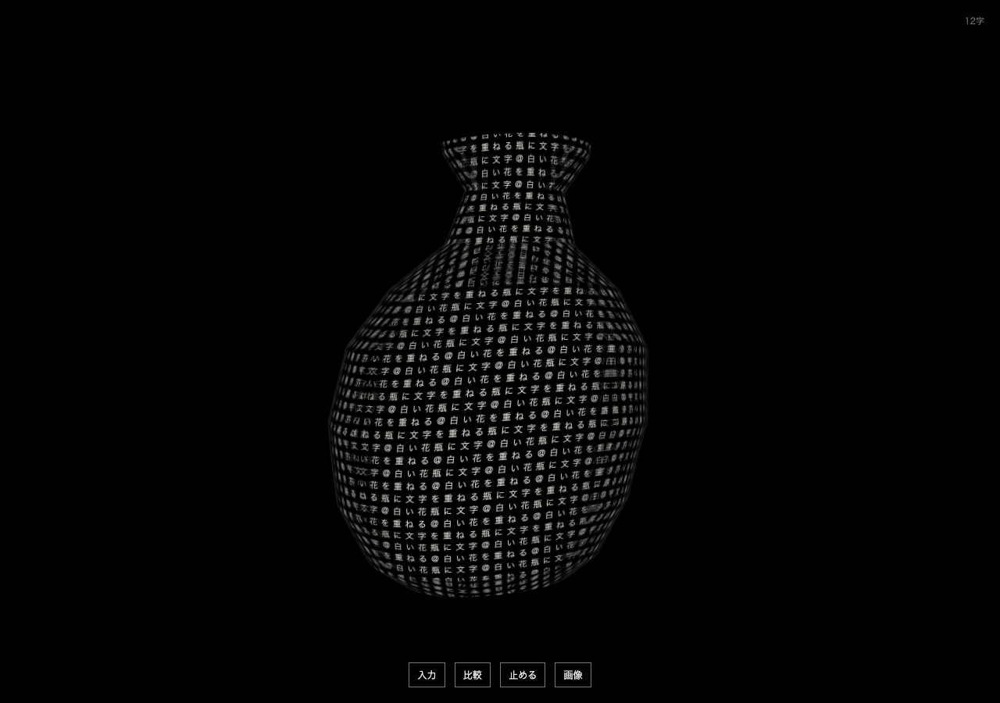
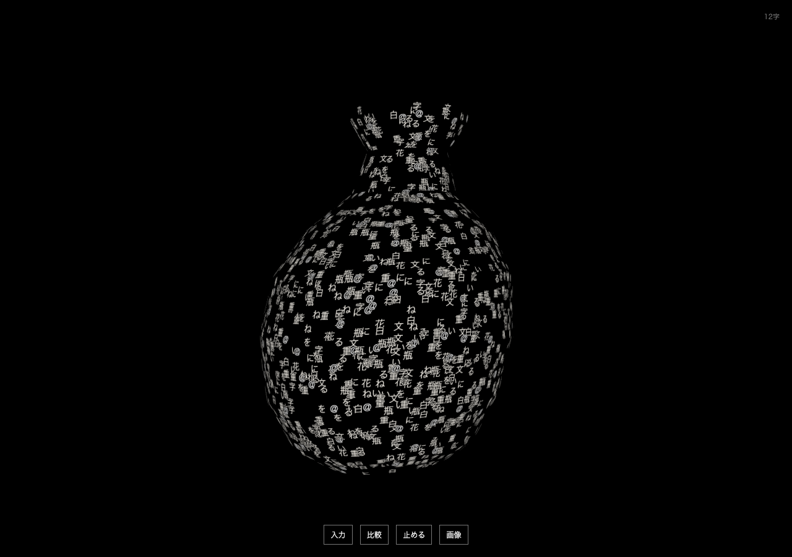

# v0.3 — 画像経由の生成と形の揺らぎ

2026-09-30。v0.2の保存済みタグを残し、この別リポジトリだけで継続。検証中の記録であり、5時間の実験全体の最終報告ではない。

## 画像経由を操作画面へつなぐ

比較の「文章→画像→立体」で、日本語から短い英語の物体説明を得て、SDXL Turbo → 背景除去 → TripoSRへ渡す。最後のGLBへ、英訳ではなく入力した日本語を加える。これは毎回その場で生成する経路で、保存済みGLBを検索して返すものではない。

**Powered by Stability AI**。モデル条件・元実験は [画像経由API](../text-image-live/README.md) を参照。API初回実測は起動・モデル検査・読込込み29.808秒。前景抽出が失敗した場合に元の形と文章を保持するブラウザ試験も通過した。対応が曖昧な場合に、入力を勝手に短縮して生成を続けない。

## 文字と母体の変形

「形の揺らぎ」を0〜1で追加。初期値0。位相と空間方向の異なる小さな正弦変形を重ね、輪郭をゆっくり歪ませる。文字の移動速度・全体の回転とは独立して調整できる。物理的な流体シミュレーションではなく、変位は約0.18以内の視覚的変形。

面全体を覆う表示では、変形前の座標を文字の投影に使い、頂点と法線を変形する。面を歩く表示では、文字が乗る三角形の変形後の3頂点から、その文字を改めて配置する。

最初は文字位置にも同じ非線形変形を直接かけたが、低ポリゴンの母体が3頂点間を直線補間するため、面の内部で両者がずれた。Kenneyの花・木・きのこで文字中心が裏へ沈む問題を数値で再現し、三角面内の座標で再構成する方式へ修正した。追加の面再分割はしない。平面文字の角が隣の面へ食い込む、または曲面から浮く既存の制限は残る。

ブラウザでは白い花瓶を用い、文字の流れと回転を止めても変形で画像が変わること、一時停止で同じ画像を維持すること、両描画方式でGPUエラーがないことを確認。初回はfavicon未配置の404がテストに混ざったため、空のfavicon指定を加え、再実行で通過した。

[低ポリゴンの実画面・性能記録](low-poly-motion/RESULTS.md) では、木・花・きのこの9画面で中心の沈み込みを認めず、馬モデル4,096文字・移流と変形を同時に動かした240フレームのrAF間隔は中央値/p95とも16.70msだった。これはこのMacのChrome/Metalでの実測で、全機種やGPU単体時間を保証しない。

## 実際の日本語入力

アプリ内ブラウザで「白い陶器の花瓶」を入力。独立した8B説明APIが `a white ceramic vase` と解釈し、画像経由APIからのGLBを表示した。生成段階の応答ヘッダは22.565秒。説明生成と画面への読込時間はこの値に含まない。先の29.808秒とはプロンプトが異なり、JIT等のキャッシュもあるため単純な速度改善とは扱わない。

表面は元の日本語7字と初期@の計8字が繰り返し覆う。花瓶の胴と首は読める一方、非対称な凹凸と口の歪みが見える。形の揺らぎ0.6、回転offへ切り替えて操作も確認。生成したGLBや原文の自動保存はしていない。

## 再開と記録の保全

新しい研究版の6サービス（4183〜4188）だけを終了し、`python3 tools/run-lab.py` で新規プロセスとして再起動できることを確認した。続いてCtrl+Cでこの起動コマンドが所有するサービスだけが終了し、元の4173がHTTP200を返し続けることも確認。最後に再起動し、試遊可能な状態へ戻した。モデルファイルやOSのキャッシュを消す意味での完全な冷起動ではない。

ブラウザ試験の画像出力は実行ごとに別の `.local/browser-tests/` へ保存するよう変更した。既存の公開記録へ書き戻さない。変更直前の今回の回帰画像は `regression-before-framing-v1/` に分け、古い版の公開画像は保存済みコミットの内容を維持した。

縦長画面での揺らぎも考え、カメラの画角へ最大変位0.18の余白を加えた。390×844で4時点の描画をGPUから読み、輪郭が左右12px以上内側に残ることを確認した。

最終統合の検証: 248単体テスト、26ブラウザテスト、型検査・ビルドが通過。Pythonは専用環境ごとに意味19、部品10、説明9、Shap-E生成8、画像経由11、8B専用API6を確認。生成比較の6GLBをmainから読み、文字の履歴を保持し、じょうろへ「四角く」と追記して同じメッシュを変形できることも確認した。
