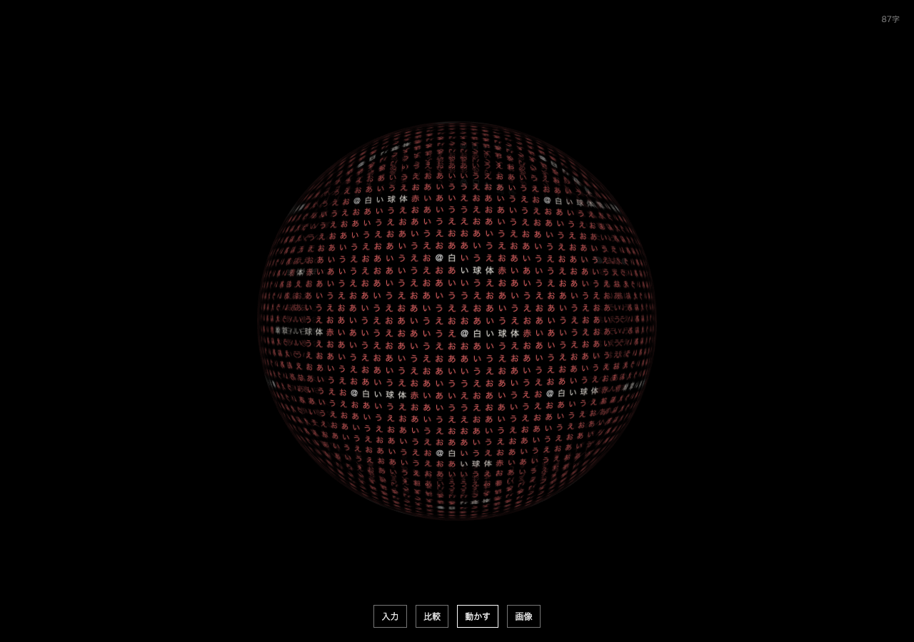
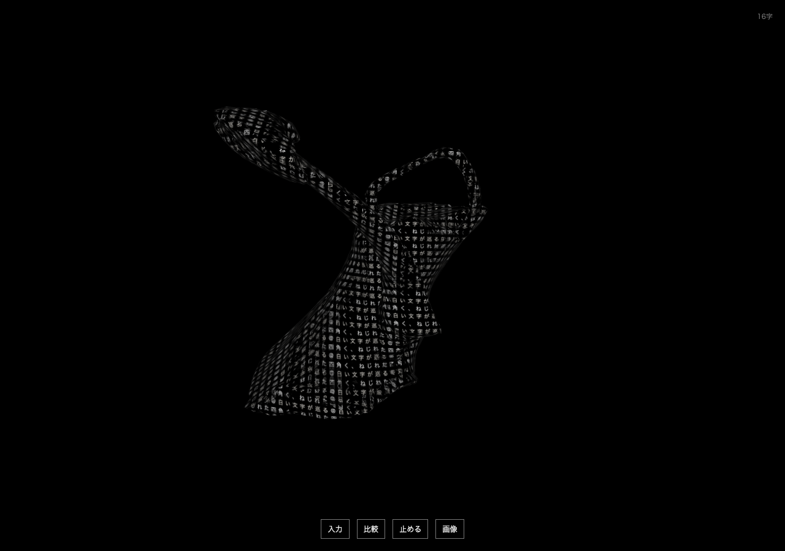

# v0.4: 素材の候補と流体表現

2026-09-30。v0.3をタグで保全し、同じ新リポジトリに追加。元ai-game-labと4173は未変更。

## 素材を選び、表面に原文を載せる

無料CC0の実メッシュ3点を共通表示へ接続した。花瓶、じょうろ、剣を文章で順位付けし、選択するまでは現在の形を保つ。検索時に原文を一度追加し、素材を選んでも重複追加しない。「四角く」「赤くねじれた」は取得メッシュ自体を変形する。

類似度だけでは未所蔵の馬を花瓶に誤対応させるため、自動採用しない。521件の研究カタログと対話用3件を混同しない。候補の検索は末尾128トークンのみ、自由文に書いた全ての条件を満たす素材の保証はない。[素材比較と全出所](../asset-retrieval/RESULTS.md)、[対話UIとAPI](../asset-retrieval/ui-v1/README.md)。

## 静かな渦の比較

「文字の動かし方」から「渦で流す・実験」を選ぶと、128²の平面速度場による移流を文字の三平面投影へ使う。文字画像を繰り返しぼかす代わりに、元atlasを座標から参照し続ける。母体の揺らぎ・四角さ・ねじれも併用できる。

60秒の比較では手動4点補間で逆写像の折返しをなくした。しかし300秒で文字が伸び、600秒では折返し358セルが現れた。長時間で字形を保持する方式としては未完成。「流れを戻す」は文字と形を保って速度・写像を初期化する。通常の既定描画は従来どおり。これは3D曲面上の流体を解く方法ではない。[失敗案・全比較・10分の制限](../fluid-surface/README.md)。

## 検証範囲

- 単体449件、型検査、build通過。禁止文の属性判定、色形容、候補応答の構造などを含む。
- 新しい素材API境界12群通過。実モデルのCPU検索も、じょうろと未所蔵の馬の人工例で確認。
- ブラウザ全38件が通過。うち追加12件は、3実GLB、二重追加/競合防止、128²の有限場、atlas 8→16、停止/再開/flow0、別mode中のsolver停止、流れリセット、生成GLB＋属性＋母体変形、非対応floatからの元mode保持を確認。
- 実IABで、日本語のじょうろ文→候補選択と、人工の花瓶文→渦＋揺らぎ0.5を操作して表示確認。
- 画面判定はエージェントによる確認。ユーザーや独立した人間の参加者による評価ではない。

このMacで確認した実験版。未検証のWindows/GPU環境や、無期限の連続動作は保証しない。通常入力はメモリ保持のみで再読み込みすると失われる。重み・人工例以外の原稿は公開していない。
