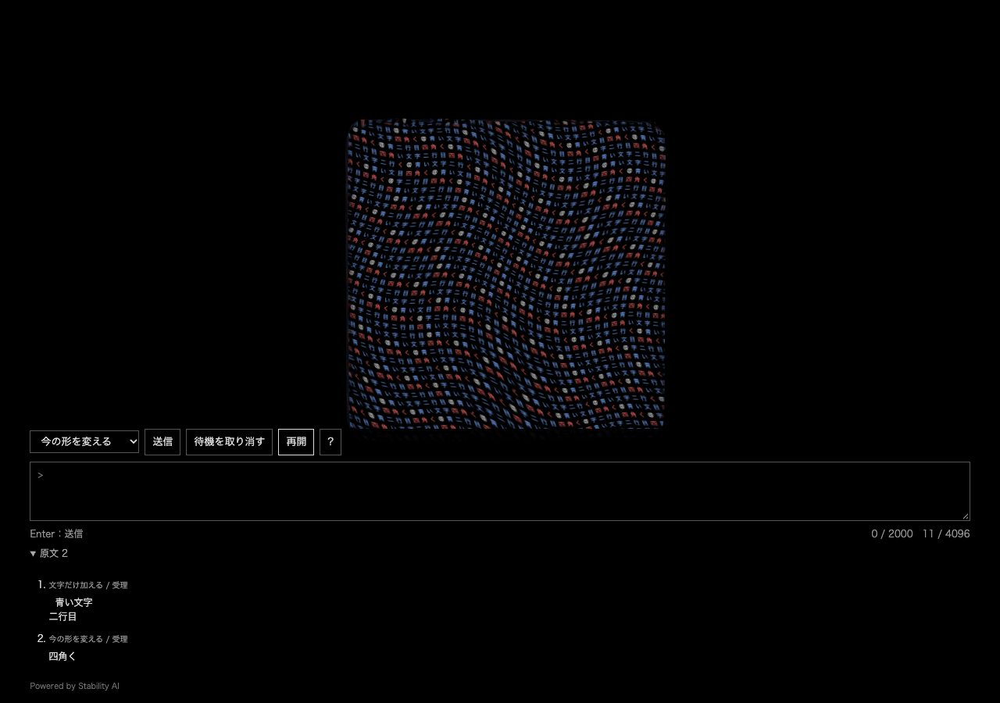

# v0.5 — 生成を待ちながら文章を加える

2026-09-30 / `prototype-v0.5.0`

別の入力画面を追加した。「文章から形を作る」「今の形を変える」「文字だけ加える」を送信ごとに固定し、重い生成中も原文と文字を先に受け取る。既定画面と以前の試作は残し、比較パネルに別入口へのリンクを置いた。

## 修正した境界

生成に失敗した後、不正な編集入力も失敗すると、先の生成を再試行する情報が失われていた。生成失敗と入力失敗を別に保持し、どちらも文字を二重追加せず再試行できるようにした。対象を変更・取消したときは古い生成を戻さない。CPU回帰試験9件を追加した。

## 確認

- 単体458件、TypeScript型検査、Viteの2入口ビルドが通過。Viteは741KBの共通描画chunkにサイズ警告を出すが、ビルドエラーはない。
- 連続入力のブラウザ試験12群が通過。[原文・IME・上限・遅延・取消・再試行](../writing-preview/README.md)
- 実モデル1回では3入力・26字の保持と後追い四角化が成立した。faviconとGLB保存の失敗を含むため測定全体は失敗のまま記録。別の既存花瓶で保存処理を再生検証した。意味精度を証明した実験ではない。
- 開発表示とは別に、生成した `dist` の両入口を4191で実操作。リンク、文字追加、四角化、改行と空白を含む原文保持、停止・再開の9項目が通過。14 GETは全200、POST・外部要求0、JavaScript/GLエラー0。[結果](build-smoke-v1/run-2026-09-30T07-53-44-868Z-70470/result.json)
- Codexの実ブラウザでも人工文 `窓辺に花瓶を置き、水を注いだ。` を文字として追加し、`青く四角く` で面を文字が覆う箱状へ変形、原文2件の表示を確認した。
- 新しい7サービスの起動・状態確認を実施。元の4173は変更せず、旧リポジトリのHEADは `782c35d6d50b983355db73ccfbd2542585288474`、作業差分なし。

## 残る制限

原文と状態はメモリだけに保持し、再読込で消える。自動の意味振り分け、任意部分編集、周期的な意味の変更、他アプリの執筆との連動は追加していない。生成中の取消は採用を無効化する操作で、実行中の推論プロセス自体を中断する機能ではない。新規Macへの重いモデル一括導入、Windowsでの実行は未検証。

ビルドは既存出力を消さない設定にし、専用入力画面も出力へ含めた。原試作、モデル、過去実験、失敗記録の削除はしていない。
