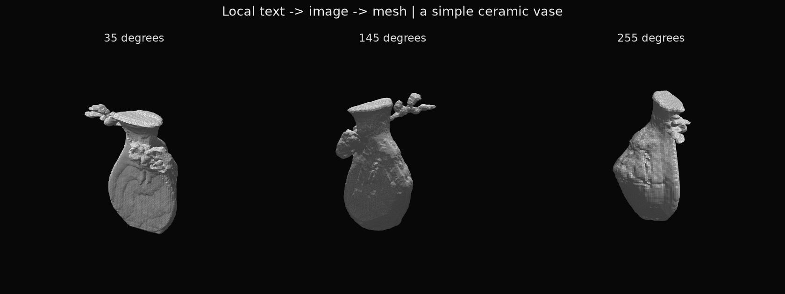

# HTTPでの実測

2026-09-30、Apple M5 / 32GB。起動済み4187 APIへ、固定した人工文 `a simple ceramic vase` を1回送った。画像workerと立体workerは各要求で新規起動する。

| 項目 | 結果 |
|---|---:|
| HTTPクライアントの待ち時間 | **29.808秒** |
| API内部の総時間 | 29.797秒 |
| 前半の画像worker全体 | 11.022秒 |
| 画像の推論とPNG化 | 2.509秒 |
| 立体推論からGLB検査まで | 1.690秒 |
| 最終プロンプトのCLIP token | 28 |
| 返却GLB | 437,192 bytes |
| 頂点 / 面 | 12,123 / 24,242 |

2つのPython起動、モデルハッシュ確認、ロード、背景除去を含むと、以前の推論時間だけを足した値より長い。後半worker全体は差分で18.775秒だが、import・モデル読込・背景処理を個別には計時していない。新しいruntimeにNumbaのJITキャッシュが初めて作られたことも確認した。2回目が何秒になるか、どの初期化が何秒を占めたかはこの実験では未測定。API本体の起動前の時間はこのHTTP待ち時間に含めない。

首と胴があるので花瓶としては読めるが、「simple」に反する枝のような突起や模様があり、裏側は平たい。閉曲面・1成分・有限座標・整合した面方向であることと、文章に沿うことは別である。APIの品質ゲートを通過しても、このような意味・外観上の誤りは残る。自動生成された形を確認し、採用するか選べる実験用経路として扱う。

[機械可読の数値](vase-http-v1/result.json) にHTTPヘッダとGLBのSHA256を残した。元のGLB・生成画像はサービスにも検証clientにも保存せず、検証clientが人工例の比較PNGだけを保存した。runtimeにはHFの版記録、フォント一覧、Numbaのコードキャッシュがあり、入力や画像のファイルはない。既存TripoSR公式ソースの `git status` もcleanのまま。

## 境界検証

CPUの11件が通過。特に、最終プロンプトが77tokenを超える場合を両CLIPで拒否し、切り捨てないこと、時間切れで無関係なプロセスを止めないこと、2workerを合わせた制限時間を守ること、極小マスクを失敗として返すことを確認した。

さらに起動中の4187に対し、非ASCII・CLIP超過・過大body・不正Host・不正Originの5件を実HTTPで拒否できた。[記録](http-boundaries-v1.json)。これらはモデル推論を起動しない。

単一要求の実生成を確認した段階である。長時間の繰り返し負荷、他のGPUモデルとの同時実行、任意物体に対する成功率は測定していない。GPUは担当間で時間を分けて使用した。
