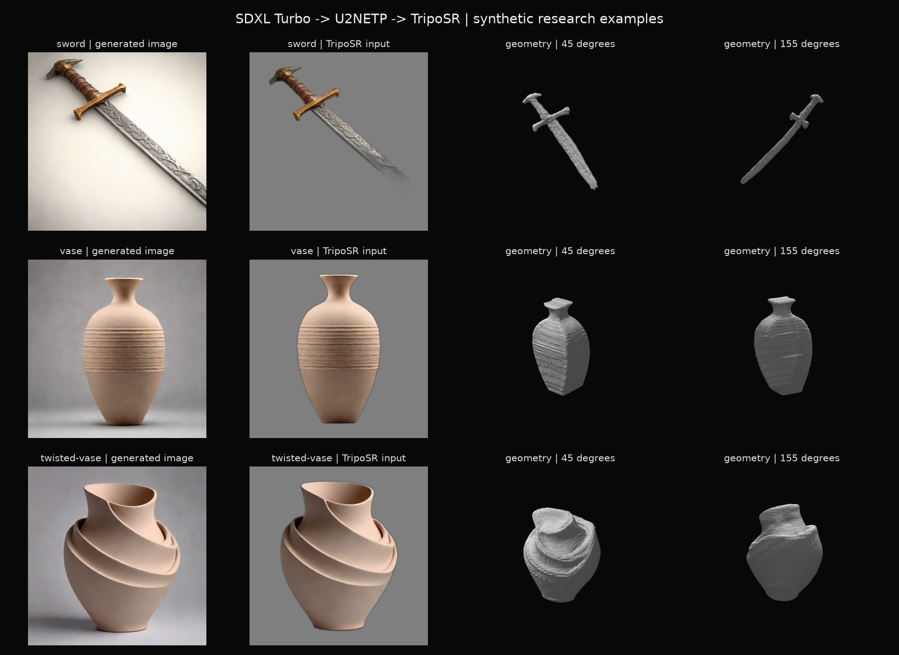
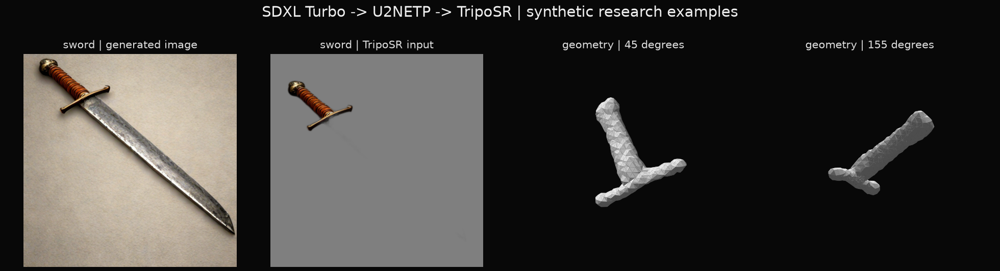
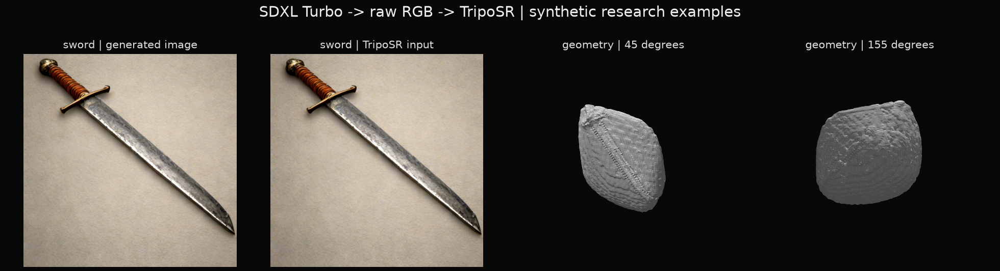
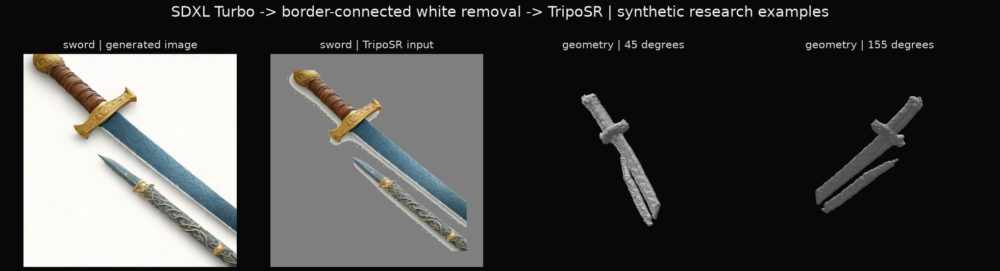

# 画像を経由する6立体の結果

2026-09-30。SDXL Turbo 512px / 4 step / fp16 MPS → U2NETP CPU → TripoSR float32 MPS / 128³。入力は人工英語。初回3例のfixtureを生成前に固定し、剣の構図のみ1回探索的に変更した。再試行は未見評価ではない。

## 外観

| 例 | 画像 | 背景除去・立体 | 判断 |
|---|---|---|---|
| 剣 | 柄と鍔は明瞭だが、先端が画像外。指定した直立・灰色にも従わない | 背景除去が刃先をさらに消し、短い刃として復元 | 部分的。長い剣という条件は満たさない |
| 花瓶 | 首と丸い胴が分かる。指定外の横筋あり | 首・胴は残るが、背面が平たく、横筋が立体の凹凸になる | 部分的。見えない側の丸みが不安定 |
| ねじれた花瓶 | 口と胴にねじれが見える | 大きな輪郭は残るが、裏側まで同じねじれを復元しない | 部分的。微小な別成分もある |

剣は同じseedで「全体を画面内に」「余白」「正面」を強めた。画像の先端は収まったが、U2NETPが刃をほぼ全て背景へ分類した。結果は柄と鍔だけに近い。画像生成の改善が、後段の改善を保証しないことが分かる。

初回の単行比較図 `comparison.png` はタイトルが重なったため、同じデータから余白を増やした `comparison-v2.png` を別保存した。元の図も残している。

## 時間と形状

秒数は各段階で同期して測定。合計は別プロセスで測った各段階の和で、冷起動からの一続きの待ち時間ではない。モデルロード・ハッシュ確認を含まない。

| 例 | 画像 | 前処理 | 立体推論 | 面抽出 | 段階の和 | 頂点 / 面 | 成分 |
|---|---:|---:|---:|---:|---:|---:|---:|
| 剣・初回 | 6.438 | 0.130 | 1.937 | 0.602 | 9.107 | 2,939 / 5,874 | 1 |
| 花瓶 | 1.610 | 0.114 | 1.012 | 0.374 | 3.110 | 10,822 / 21,640 | 1 |
| ねじれた花瓶 | 1.542 | 0.111 | 1.010 | 0.382 | 3.044 | 19,968 / 39,928 | 2 |
| 剣・構図再試行 | 1.790 | 0.137 | 1.233 | 0.386 | 3.545 | 786 / 1,568 | 1 |

初回画像runは初期化9.987秒、全体19.633秒。別プロセスの初回立体runは初期化2.550秒、全体8.308秒。画像runのプロセスRSS最大566,722,560 bytes、終了時MPS driver割当9,690,726,400 bytes。立体runはRSS最大4,101,750,784 bytes、MPS driver割当2,594,914,304 bytes。統一メモリなので両者を足して総消費量としない。MPSの値もピークではなく終了時の観測値である。

4個全てで有限座標・閉曲面・整合した面方向・正の体積を確認した。剣再試行のように、これらを満たしても文章に合わない場合がある。ねじれた花瓶は面積の99.9679%を最大成分が占める。原形を残すため小片は取り除かなかった。

## Shap-Eとの関係

先行 [Shap-E実験](../shap-e/RESULTS.md) の剣・花瓶・ねじれた花瓶と同じsubjectを用いた。ただし画像向けの背景・画角の文を付け足しているため、同一プロンプトの厳密な比較ではない。モデルをまたいで同じseed番号を使っても、同じ乱数過程にはならない。

Shap-Eは32 stepで約39〜40秒だったのに対し、この画像経由の段階合計は初回剣を除けば約3秒だった。画像生成の初回コンパイル・ロード等を含む待ち時間、複数seed成功率、品質を揃えた比較は未実施なので、一般的な速度優位の主張にはしない。画像経由は中間画像を見て修正でき、ねじれの視覚的説明が得やすい一方、切り抜き誤りと見えない背面の推定誤りが加わる。

## 背景処理の追加比較

同じモデルのまま剣の2案を追加した。元の画像・GLB・manifestは保持し、公開indexの初回4件版も `public-manifest-initial4.json` に残した。

1. **RGB画像をそのまま渡す。** 構図再試行の画像を使い、前景除去とサイズ調整を省いた。画像を作り直していないので同じ入力画像の対照である。背景を含めた厚い板になり、独立した剣の形は得られなかった。公式の背景が既に整ったRGB例が動くことは、一般の背景付き画像での成功を意味しない。
2. **単色の物体・白背景を生成し、明るい外周背景を除く。** 同じseedで「全体が濃い青」「一本の完全な剣」「白背景」を指定。画像は青い刃を描いたが、柄は金色、別の剣も現れ、画面外に切れた。単純な白背景の除去は刃を残したものの、復元も二股状の剣と別成分になった。前景抽出の改善と、プロンプトへの適合は別問題だった。

| 追加案 | 画像 | 前処理 | 立体推論 | 面抽出 | 段階の和 | 頂点 / 面 | 成分 |
|---|---:|---:|---:|---:|---:|---:|---:|
| RGBそのまま | 1.790（既存） | 0.015 | 1.114 | 0.403 | 3.321 | 14,133 / 28,262 | 2 |
| 青い物体 / 白背景 | 1.691 | 0.049 | 1.229 | 0.391 | 3.359 | 4,784 / 9,560 | 2 |

前者の段階の和には比較のため既存画像の生成時間を含めたが、追加runでは再生成していない。後者は生成画像の変更とマスク方法を同時に変えた探索例であり、マスク手法だけの効果を切り分けた実験ではない。

CLIP tokenizerの上限77に対して、初回プロンプトは46 / 47 / 44 token、剣再試行は61、青い剣は66だった。この範囲では入力末尾の切り捨てで失敗したとは説明できない。長文の理解力はこの少数実験では評価していない。

6件全てのGLBハッシュ、有限座標、面番号、Z-upからY-upへの回転一致を [verify.py](verify.py) で再確認した。結果は [verification-v1.json](verification-v1.json)。3D生成は全件完走したが、意味への適合は初回3件が部分的、剣の再試行と2追加案は失敗として公開manifestに明記した。

## 今回の採否

花瓶のような面積のある対象では、画像を経由する方式を次の比較候補として残す。細い刃・単体数・切れのない全体像を指定できる保証はなく、現段階で全ての語をこの経路へ送る実装は採用しない。画像、前景マスク、複数視点の立体を確認してから面表示へ渡せる構成が必要である。本文→物体説明の抽出や翻訳、自由入力API、文字面での可読性は別の結合検証で扱う。
