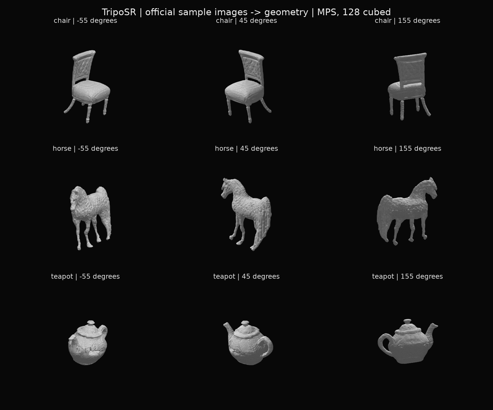

# TripoSR のMac実測と外観

2026-09-30。Apple M5 / 32GB、Python 3.12.14、PyTorch 2.14.0、float32。公式ネットワークに実験側のMPS指定・CPU marching cubesを組み合わせた。公式ソースを変更していない。取得条件と互換処理は [README](README.md)、各値は保存したrunのmanifestにある。

## 実測

| Run / 入力 | デバイス | 抽出格子 | ネットワーク | メッシュ抽出 | 頂点 / 三角形 |
|---|---|---:|---:|---:|---:|
| 初回の椅子 | MPS | 64³ | 1.939秒 | 0.283秒 | 2,448 / 4,896 |
| 椅子 | MPS | 128³ | 1.140秒 | 0.410秒 | 10,224 / 20,448 |
| 馬 | MPS | 128³ | 1.032秒 | 0.395秒 | 10,711 / 21,418 |
| ティーポット | MPS | 128³ | 1.023秒 | 0.397秒 | 11,814 / 23,636 |
| 椅子・CPU比較 | CPU・4 threads | 64³ | 2.610秒 | 0.088秒 | 2,448 / 4,896 |

ネットワークは画像から潜在表現を得る部分、抽出は密度の照会・CPU等値面抽出を含む。MPSは区間の前後で同期した。モデル取得時間、画像準備、ファイル保存、ブラウザ表示は上記2列に含まない。

128³・3例runは初期化2.675秒、一括全体7.167秒。初回64³の初期化は2.703秒、CPU64³は2.338秒。初期化には設定・重みの再ハッシュと読込を含む。MPS初回と次runの差には実行時キャッシュ等もあり、3例各1回から一般的な中央値や最悪時間を推定しない。

128³runのプロセス最大RSSは3,781,853,184 bytes、終了時MPS driver割当は2,594,914,304 bytes。共有メモリなので合計して総使用量とはしない。サンプル3件と二つの比較runはすべて成功し、外向き接続の試行は0回だった。[初回MPS64](mps64-probe/manifest.json)、[MPS128](mps128-three/manifest.json)、[CPU64](cpu64-chair/manifest.json)

## 外観を3方向から確認

同じ灰色の面表示で確認し、元画像の色を貼って見た目を補ってはいない。

- **椅子:** 背もたれ・座面・脚は識別でき、背面も形になった。一方、脚が不自然に外へ曲がり、画像に見える脚の配置や座面の形を正確に保持したわけではない。
- **馬:** 頭・胴・四肢・尾の輪郭は読み取れる。表面は粗く、脚の太さや顔の細部は曖昧。裏側の正しさを確認する正解3Dは用意していない。
- **ティーポット:** 注ぎ口・持ち手の穴・蓋を識別できる。胴に不自然な凹凸があり、入力画像の反射や模様を形の起伏として解釈した可能性がある。これは外観からの推測で、原因を分離する対照実験はしていない。

これは配布元の作例画像を使った動作確認で、独立した未知画像の精度評価ではない。テキストだけを入力するShap-Eとは情報量と課題が異なるので、速度や3例の見た目だけから優劣を結論づけない。

## メッシュと互換処理の確認

5回の生成出力は全て有限座標、閉曲面、面方向の整合、正体積、1連結成分を確認した。GLBを書き出して読み直した後に検査した値である。閉曲面であることは、椅子の脚や動物の構造が正しいことを保証しない。

CPU marching cubesへの置換は、人工球の閉曲面・正体積・体積誤差、非対称な楕円体の軸と位置の2テストで確認した。標準出力にはscikit-image / NumPy 2.5の非推奨警告が出るが、テストは通過した。公式 `torchmcubes` と全トポロジーが同一という検証ではない。[検証コード](test_compat.py)

同じ椅子・64³のCPU/MPS比較では面のインデックスが一致し、頂点座標の最大差は約`1.57e-5`、最近傍頂点の平均距離は約`1.91e-7`だった。互換経路のデバイス間差が小さいことを確認したもので、正解メッシュに対する誤差ではない。[比較値](cpu64-chair/cpu-mps-parity.json)

共通ビューアには元のZ-upからY-upへ回転した別ファイル3件を渡す。回転以外の修復・削減・平滑化はしていない。元GLB、派生GLBそれぞれのハッシュを記録し、元は残した。[派生の検査値](mps128-three/viewer-derivatives.json)、[公開manifest](../../public/reconstructed/manifest.json)

## 採否

**画像→面の候補取得として採用できる。** このMacでCPU・MPSの両方が動き、数秒で共通描画へ渡せるGLBを得られた。文字を面に載せる用途では元の色やテクスチャを生成する必要がない点も合う。

**文章→適切な画像を得る部分は未実装。** 任意の文章からこの精度で形を出したとは言えない。今後は、許可された画像候補の意味検索、ローカル画像生成、単純な手続き画像をそれぞれ別条件としてつなぎ、題材の一致と形の品質を分けて測る。今回はこの中間段階が端末内で実行できることまでを確認した。
