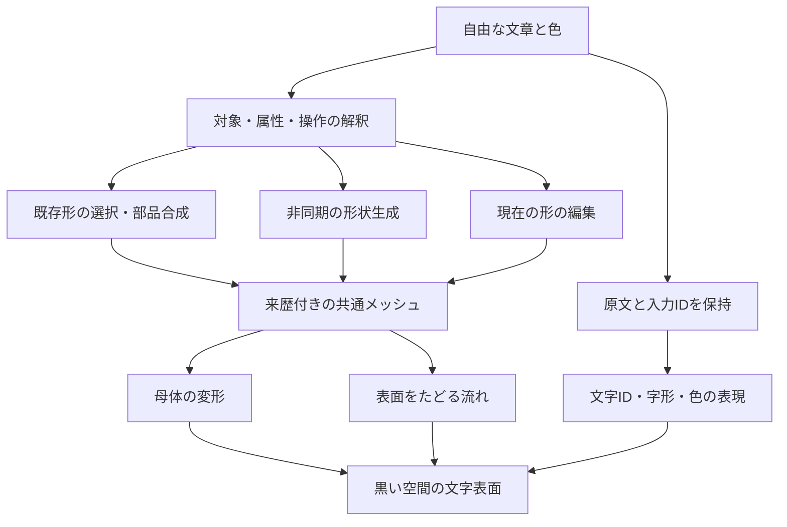

# 次の研究方針：文章で変わる形と、表面を流れ続ける文字

決定日: **2026-09-30**。対象: Semantic Glyph Lab。これは次の実験の設計であり、実装済み機能や実測結果の報告ではない。

**最優先は、文字が面を覆ったまま、長時間、静かに不規則に流れる表現の改善とする。形状生成ではCube 3Dを条件付きの比較候補に選び、その次に言葉による部分編集へ進む。** 形状モデルの交換だけで文字の流れが良くなるとは考えない。

- [先行研究6件と制作例1件](prior-art-20260930.md)：根拠、公開状況、導入条件。
- [比較条件と合否の決め方](evaluation-plan-20260930.md)：同じ条件で何を測るか。
- [保存版v0.5の実測結果](RESULTS-20260930.md)：今回の方針の出発点。

## 1. 何を完成へ近づけるか

文章を加えると、その言葉が立体の表面に増える。文章の意味を使って形を選ぶ・作る・編集でき、待っている間も文字は流れる。形と文字の流れはゆっくり変化し、黒い空間で眺め続けられる。入力文そのものと、形を作るために解釈・翻訳した説明は別に持つ。

今回の研究上の問いは、**意味によって母体が変わっても、入力された文字と色を失わず、面の被覆と流れの連続性を保てるか**。単に生成メッシュが高精細かどうかだけでは成功としない。新規性や世界初を主張するには追加の文献調査と比較が必要で、現段階は研究試作とする。

初めの見せ方は黒背景、文字の身体、必要な時だけ開く入力欄を維持する。実験の数値や方式名は比較用の画面へ置く。新しい宣伝文、常時表示の説明、花火のような強い点滅を増やすことは今回の改善目標に含めない。

## 2. 既存結果から決めた優先順位

| 順序 | 決定 | 理由 | 次へ進む条件 |
|---|---|---|---|
| 0 | v0.5と入力保全を比較基準として固定 | 形の誤りと文字の消失を同じ不具合にしない | 同じ人工入力・形・色で基準画像と原文履歴を再現できる |
| 1A・主軸 | 文字の伸長を抑える表面表示を独立試作 | 現流体実験は300秒の積分で伸び、600秒で折返す | 30分の実時間と固定刻みの検証で、線への退化・露骨な更新・原文欠損を改善 |
| 1B・並行可能 | Cube 3D v0.5をMacの形状生成比較候補にする | 公式がMPSを案内し、文章から直接メッシュを得られる | 利用条件の適用範囲を確認し、1例の起動・メモリ・出力読込を実測してから比較を増やす |
| 2 | 形を保つ部分編集を試す | 毎回生成し直すと、文章の追記と形の変化の対応を追いにくい | 対象を指定した編集で、変更箇所と維持箇所を別々に判定できる |
| 3 | 表面流れと母体の変形、形の切替を統合 | 静止面で成功しても、変形・切替で文字が消える可能性がある | 非同期入力、取消、追記、色、メッシュ交換の比較を通す |

1Aと1Bはファイル・環境を分けて開発できる。ただしGPU負荷の計測中は、生成と描画の比較を同時に走らせない。同時負荷は最後に別条件として測る。

既存の[方針](implementation-options.md)と[結果](RESULTS-20260930.md)にある「次に小さな振り分けモデルを学習する」案より、今回は上の順序を優先する。過去の案と失敗記録はそのまま残す。

## 3. 採る構成

モデルは形状の候補を作り、描画側が原文から文字を載せる。モデルが生成した画像内の文字を原文の代わりに使わない。表示のために文字を繰り返して面を埋めることと、受理した実際の文字数は区別する。

現v0.5の「文字だけ」「新しい形」「今の形の編集」の明示選択を引き継ぐ。自由な文章から操作まで自動判定する機能は、既存の不採用結果を覆す評価が得られるまで既定にしない。意味の解釈・生成が失敗しても、受理済みの原文と現在の形を保持する。

入力履歴は現在ページ内のメモリだけで、再読込で消える。今回の文書で永続保存を実装済みとはしない。将来の再現記録には人工文章を使い、個人の執筆内容を自動収集しない。[現在の入力仕様](../experiments/writing-preview/README.md)

## 4. 表面表現の実験をどう進めるか

最初は同じ静止球と花瓶に、同じ文字と速度場を使う。生成モデルの良し悪しを混ぜず、次の3条件を比較する。

| 条件 | 試す内容 | 分かること・残る問題 |
|---|---|---|
| F0 基準 | 既存の2D流体を三方向から面へ投影 | 同じ5分・10分の伸びを再現し、改善幅を測る。曲面固有の流体ではない |
| F1 短い移流をつなぐ | 異なる時刻から始まる2枚の座標写像を交替させ、更新を混ぜる | 長時間の伸びを抑えられるか。二重の文字、ちらつき、流れの巻戻りが新たに出る可能性がある |
| F2 字形を保つ面上の配置 | 文字IDと面上の中心・向きを持ち、小さな曲面パッチへ字を描く。配置の歪みが大きい部分を更新する | 字形と原文を保ちやすいか。急曲面、継ぎ目、面からの浮き、被覆の穴を確認する |

F1/F2は**本プロジェクトの応用案**であり、先行論文をそのまま再現するものではない。[大変形テクスチャの研究](https://visualcomputing.ist.ac.at/publications/2026/DeformableTextures/)は歪みに応じた模様の扱いを参考にするが、日本語の各字を保存する方法としての有効性は未検証である。F2でも粒子を線上に並べるだけに戻さず、文字が面全体を覆う密度を比較する。

F1/F2で伸びへの対処を見極めた後、速度場を平面投影から曲面上へ進める。[Viscous Vortex Dynamics on Surfaces](https://cunchengzhu.github.io/project_pages/ViscousVortex2025.html)の曲率を含む流れを調べ、まず球・取っ手のある面など小さな対象で参照結果と比較する。ブラウザ移植・低負荷化・変形面への対応は別の実装課題であり、公式Houdiniコードを接続するだけで完成するとはしない。

母体の変形は次に加える。表面の流れ、物体全体の回転、形の変形を独立にON/OFFし、何が見た目を変えたか分ける。メビウスの輪では表裏の向きが一周で反転するため、文字の向き・裏面・継ぎ目の扱いを記録する。任意の生成メッシュが滑らかな多様体であるとは仮定せず、壊れた隣接関係や非多様体辺では基準描画へ戻す。

## 5. 形状生成と編集の決定

**Cubeは採用済みエンジンではなく、次の研究比較の第一候補。** [公式](https://github.com/Roblox/cube)の通常推論を対象にし、Mac非対応の高速推論を前提にしない。v0.5の条件と、v0.1を対象名に残す研究限定LICENSEの関係を取得前に整理する。不明なまま重みや出力の公開・アプリ同梱へ進めない。確認できなければ比較は保留し、表面研究を続ける。

試す場合は、日本語→既存8Bの短い英語説明→Cube→OBJ/GLB→同じ文字描画とする。英語説明を全方式で共通に固定した「生成だけ」の比較と、日本語からの全経路の比較を分ける。現Shap-Eと画像→TripoSRの結果も残す。Macの対応例があっても、このM5・32GBでの速度やメモリを未測定のまま保証しない。

**部分編集はProx-Eの考え方を参照し、まず限定した構造編集を作る。** 初期対象は、部品名が確実な手続き花瓶と、その取っ手・口・胴。操作は対象と寸法変更を明示したものに絞り、変更しない部位の形と位置を保持する。名詞の認識、部位の分割、編集そのものを別々に評価する。生成メッシュの未知部位を正確に分割できるとは扱わない。

[Prox-E](https://github.com/etaisella/Prox-E)の完全な再現は別課題とする。公開実装はTRELLISなどの依存を持ち、ローカルQwenの編集精度にも著者の注意書きがある。大きなVLMへ置換すれば解決するという前提や、有料APIの利用は置かない。

| 保留するもの | 再検討の条件 |
|---|---|
| TRELLIS.2のローカル比較 | 公式のLinux/NVIDIA条件を満たす無料で利用可能な環境が確保でき、ライセンス・依存を確認できた時。Macへ無理に移植する作業は今の優先外 |
| Hunyuan3D-Buffalo 1.0 | 推論コード・必要な重み・利用条件が公式に公開された時。論文公開だけを導入可能と扱わない |
| 小型モデルの追加学習 | 手続き編集の操作体系と評価条件が固まり、未見文に対する既存方式の弱点を測った後 |
| 自動の形切替・日記・他アプリ連動 | 表現と入力保全を確認した後の別段階。周期変化は当面、意味の入替ではなく流れと母体の変形で試す |

公開状況と根拠の詳細は[先行研究整理](prior-art-20260930.md)。最新モデルの定期監視は今回設定しない。

## 6. 進捗と成果物の残し方

この計画を追加する版では文書だけを変更する。`prototype-v0.5.0`、旧ブランチ、元のアプリ、実験画像、失敗結果を保存し、履歴を書き換えない。後続の試作はこの方針を基に新しいブランチ・新しい実験ディレクトリへ作る。既存結果へ測定値を上書きしない。

各実験は「問い／比較条件／実測／画像／失敗／採用範囲／次の判断」を一組にする。モデル・依存のrevision、seed、生成物の来歴、実行端末、時間と負荷を記録する。重み・私的な文章・参考書・画像を公開Gitへ入れない。成果物の配布条件が未解決なら公開するのは調査判断までとする。

### 次の実装チェックリスト（すべて未着手）

- [ ] R0: 基準入力・形・表示条件を固定し、再現記録を追加する。
- [ ] F1: 2枚の座標写像を交替させる独立試作と、更新時の比較画像を残す。
- [ ] F2: 文字IDを保つ局所的な面配置とF0/F1の比較を行う。
- [ ] G1: Cubeの条件確認、Macでの1例の実行、可能なら同条件の形状比較を行う。
- [ ] E1: 既知部品への限定編集で、変更部と維持部を評価する。
- [ ] I1: 採用した表面方式と非同期入力・母体変形を統合し、戻せる新しい試遊版を残す。

チェックは実験結果へのリンクとともに更新する。「コードが動いた」「見た目が改善した」「未見例にも効いた」は別々に報告する。今回決めたのはこの順序と合否の基準であり、上の改善が完了したという意味ではない。
